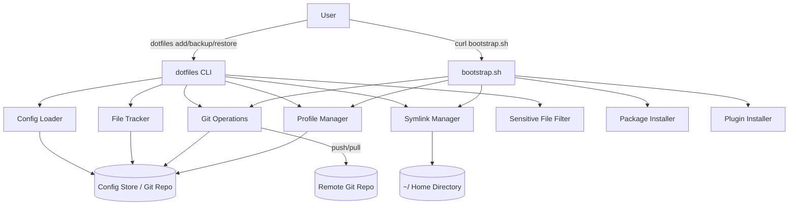

# Design Document: zsh-dotfiles-setup

## Overview

The zsh-dotfiles-setup system is a portable dotfiles management tool implemented as a collection of POSIX-compatible shell scripts. It provides a CLI (`dotfiles`) that tracks configuration files in a git repository, manages symlinks, handles profile-based configuration, and bootstraps a complete shell environment on a new machine with a single command.

The system is intentionally implemented in pure shell (bash/sh) with no external runtime dependencies beyond standard POSIX utilities and git. This ensures it can bootstrap itself on any Unix-like system without requiring Node.js, Python, or other runtimes to be pre-installed.

### Key Design Goals

- **Zero-dependency bootstrap**: The bootstrap script requires only `curl`/`wget`, `git`, and a package manager (`apt`, `brew`, `yum`, or `pacman`).
- **Idempotent operations**: Every operation can be safely re-run without side effects.
- **Profile isolation**: Different machine types (personal, server, work) get different tool sets and configs.
- **Safety first**: Sensitive files are excluded by default; existing files are backed up before replacement.
- **Transparency**: Dry-run mode and verbose logging make every action visible before it happens.

---

## Architecture

The system is organized as a single git repository (the Config_Store) that contains both the dotfiles themselves and the management scripts.

```
dotfiles/                          # Config_Store root (git repo)
├── bin/
│   ├── dotfiles                   # Main CLI entry point
│   └── bootstrap.sh               # Single-command bootstrap script
├── config/
│   ├── dotfiles.conf              # Global configuration (remote URL, defaults)
│   └── exclusions.txt             # Default + user-defined exclusion patterns
├── profiles/
│   ├── default.yaml               # Default profile manifest
│   ├── personal.yaml              # Personal machine profile
│   ├── server.yaml                # Headless/server profile
│   └── work.yaml                  # Work machine profile
├── plugins.txt                    # Plugin manifest (one plugin per line)
├── tools.txt                      # CLI tools manifest
├── files/                         # Stored configuration files (mirroring home dir)
│   ├── zsh/
│   │   ├── .zshrc
│   │   ├── .zprofile
│   │   ├── .zshenv
│   │   ├── .zsh_aliases
│   │   └── .zsh_functions
│   ├── git/
│   │   └── .gitconfig
│   ├── vim/
│   │   └── .vimrc
│   ├── nvim/
│   │   └── init.vim (or init.lua)
│   ├── tmux/
│   │   └── .tmux.conf
│   └── ssh/
│       └── config
├── .gitignore                     # Excludes sensitive patterns
└── README.md
```

### Component Interaction Diagram



---

## Components and Interfaces

### 1. `dotfiles` CLI

The main entry point. Dispatches subcommands to the appropriate handler functions.

**Subcommands:**

| Command | Description |
|---|---|
| `dotfiles add <path>` | Track a file or directory |
| `dotfiles backup` | Stage, commit, and push all changes |
| `dotfiles restore [--dry-run] [--profile <name>]` | Pull and re-apply all symlinks |
| `dotfiles sync` | Alias for backup + restore |
| `dotfiles status` | Show tracked files and their symlink status |
| `dotfiles profile list` | List available profiles |
| `dotfiles profile use <name>` | Set the active profile |
| `dotfiles init [--remote <url>]` | Initialize a new Config_Store |

**Interface contract:**
- Exit code `0` on success
- Exit code `1` on recoverable errors (skipped files, warnings)
- Exit code `2` on fatal errors (missing package manager, git push failure)
- All output to stdout; errors and warnings to stderr

### 2. File Tracker

Responsible for copying files into the Config_Store and creating symlinks.

**Key functions:**
```sh
track_file(source_path)        # Copy file to store, create symlink
untrack_file(store_path)       # Remove from store, restore original
is_tracked(source_path)        # Check if a path is already tracked
get_store_path(source_path)    # Compute the store path for a source path
```

**Path mapping strategy:**
Source paths are mapped to store paths by stripping the `$HOME` prefix and placing them under `files/`. For example:
- `~/.zshrc` → `$DOTFILES_DIR/files/zsh/.zshrc`
- `~/.config/nvim/` → `$DOTFILES_DIR/files/nvim/`

A manifest file (`files/manifest.txt`) records the mapping between store paths and their original source paths to support accurate restoration.

### 3. Symlink Manager

Creates, updates, and validates symlinks from home directory locations to Config_Store files.

**Key functions:**
```sh
create_symlink(store_path, target_path)   # Create symlink, backing up existing files
update_symlink(store_path, target_path)   # Update if target changed
validate_symlink(target_path)             # Check symlink points to correct store path
restore_all_symlinks(profile)             # Restore all symlinks for a profile
```

**Backup behavior:** Before replacing a regular file with a symlink, the existing file is renamed to `<filename>.bak.<timestamp>`.

### 4. Profile Manager

Reads and applies profile manifests.

**Profile manifest format (YAML-like, parsed with `awk`/`sed` for portability):**
```yaml
name: server
description: Headless server environment
extends: default
files:
  - zsh/.zshrc
  - zsh/.zprofile
  - zsh/.zshenv
  - git/.gitconfig
  - tmux/.tmux.conf
  - ssh/config
tools:
  - zsh
  - tmux
  - git
  - fzf
  - ripgrep
exclude_tools:
  - gui-apps
```

**Key functions:**
```sh
load_profile(name)              # Parse and return profile data
get_profile_files(name)         # Return list of files for a profile
get_profile_tools(name)         # Return list of tools for a profile
list_profiles()                 # List all available profiles
resolve_profile_inheritance(name)  # Merge with parent profile (extends)
```

**Profile inheritance:** A profile can `extends` another profile, inheriting its files and tools while adding or excluding items.

### 5. Git Operations

Wraps git commands for Config_Store management.

**Key functions:**
```sh
git_init(dir)                   # Initialize git repo
git_commit(message)             # Stage all and commit
git_push(remote, branch)        # Push to remote
git_pull(remote, branch)        # Pull from remote
git_clone(url, dir)             # Clone remote repo
git_set_remote(url)             # Configure remote URL
git_status()                    # Return porcelain status
```

**Commit message format:** `dotfiles backup: YYYY-MM-DD HH:MM:SS`

### 6. Package Installer

Detects the system package manager and installs tools.

**Supported package managers (in detection order):**
1. `brew` (macOS / Linux Homebrew)
2. `apt-get` (Debian/Ubuntu)
3. `yum` / `dnf` (RHEL/CentOS/Fedora)
4. `pacman` (Arch Linux)
5. `apk` (Alpine Linux)

**Key functions:**
```sh
detect_package_manager()        # Return name of available package manager
install_package(name)           # Install using detected package manager
is_package_installed(name)      # Check if a command/package exists
```

### 7. Plugin Installer

Installs zsh plugins using the configured Plugin_Manager.

**Supported plugin managers:**
- **Zinit** (default, recommended — fast, flexible)
- **Oh My Zsh** (popular, opinionated)
- **Antigen** (legacy support)

**Plugin manifest format (`plugins.txt`):**
```
# One plugin per line; lines starting with # are comments
# Format: <plugin-manager-name>/<repo-name> or full URL
zsh-users/zsh-autosuggestions
zsh-users/zsh-syntax-highlighting
zsh-users/zsh-completions
romkatv/powerlevel10k
```

**Key functions:**
```sh
install_plugin_manager(name)    # Install the configured plugin manager
install_plugin(plugin_spec)     # Install a single plugin
install_all_plugins()           # Install all plugins from manifest
is_plugin_installed(name)       # Check if plugin is already installed
```

### 8. Sensitive File Filter

Enforces exclusion rules to prevent accidental tracking of secrets.

**Default exclusion patterns:**
```
*_rsa
*_ed25519
*_ecdsa
*_dsa
*.pem
*.key
*.p12
*.pfx
*password*
*secret*
*token*
*credential*
*.env
.netrc
```

**Key functions:**
```sh
is_sensitive(path)              # Check if path matches any exclusion pattern
prompt_sensitive_confirm(path)  # Interactive confirmation for sensitive files
load_exclusions()               # Load default + user exclusion patterns
```

### 9. Config Loader

Reads and writes the global configuration file.

**Configuration file (`config/dotfiles.conf`):**
```sh
# Shell-sourceable key=value format
DOTFILES_REMOTE=""
DOTFILES_PROFILE="default"
DOTFILES_PLUGIN_MANAGER="zinit"
DOTFILES_BRANCH="main"
```

**Environment variable overrides:** All config values can be overridden by environment variables with the same name (e.g., `DOTFILES_REMOTE`).

### 10. Bootstrap Script (`bootstrap.sh`)

A self-contained script designed to be piped directly from a URL. It has no dependencies on the rest of the codebase and performs the full setup sequence.

**Bootstrap sequence:**
1. Detect OS and package manager
2. Install `git` if not present
3. Install `zsh` if not present
4. Clone the Config_Store from `$DOTFILES_REMOTE`
5. Source `config/dotfiles.conf`
6. Determine active profile (from `$DOTFILES_PROFILE` or `--profile` arg)
7. Install plugin manager
8. Install plugins from `plugins.txt`
9. Install tools from `tools.txt` (filtered by profile)
10. Restore all symlinks for the active profile
11. Print completion summary
12. Optionally set zsh as the default shell (`chsh`)

---

## Data Models

### Manifest File (`files/manifest.txt`)

A tab-separated file mapping store paths to original source paths:

```
# store_path\tsource_path
files/zsh/.zshrc\t/home/user/.zshrc
files/git/.gitconfig\t/home/user/.gitconfig
files/ssh/config\t/home/user/.ssh/config
```

The source path is stored as an absolute path at the time of `dotfiles add`. During restore, `$HOME` is substituted for the home directory prefix to support different usernames across machines.

### Profile Manifest (`profiles/<name>.yaml`)

```
name: <string>
description: <string>
extends: <profile_name | null>
files:
  - <store_relative_path>
  ...
tools:
  - <tool_name>
  ...
exclude_tools:
  - <tool_name>
  ...
```

### Plugin Manifest (`plugins.txt`)

Plain text, one entry per line:
```
# Comments start with #
<owner>/<repo>          # GitHub shorthand
https://github.com/...  # Full URL
```

### Tools Manifest (`tools.txt`)

Plain text, one entry per line:
```
# tool_name[:package_name]
fzf
ripgrep:ripgrep
bat
eza
```

The optional `:package_name` allows the install name to differ from the command name (e.g., `ripgrep` package installs the `rg` command).

### Configuration File (`config/dotfiles.conf`)

Shell-sourceable key=value pairs:
```sh
DOTFILES_REMOTE="https://github.com/user/dotfiles.git"
DOTFILES_PROFILE="default"
DOTFILES_PLUGIN_MANAGER="zinit"
DOTFILES_BRANCH="main"
```

### Exclusion List (`config/exclusions.txt`)

One glob pattern per line:
```
# Default sensitive file exclusions
*_rsa
*_ed25519
*.pem
*password*
*secret*
*token*
# User additions below
```

---

## Correctness Properties

*A property is a characteristic or behavior that should hold true across all valid executions of a system — essentially, a formal statement about what the system should do. Properties serve as the bridge between human-readable specifications and machine-verifiable correctness guarantees.*

### Property 1: Symlink round-trip correctness

*For any* tracked file, after running `dotfiles add <path>` followed by `dotfiles restore`, the original path SHALL exist as a symlink pointing to the correct file inside the Config_Store, and the content accessible via the symlink SHALL be identical to the original file content.

**Validates: Requirements 1.2, 5.2**

### Property 2: Idempotent restore

*For any* filesystem state, running `dotfiles restore` twice in succession SHALL produce the same filesystem state as running it once — no additional backup files created, no symlinks changed, no errors emitted on the second run.

**Validates: Requirements 7.1, 7.2, 7.3**

### Property 3: Sensitive file exclusion

*For any* file path matching a pattern in the exclusion list, calling `is_sensitive(path)` SHALL return true, and `dotfiles add <path>` SHALL NOT silently add the file to the Config_Store without user confirmation.

**Validates: Requirements 8.1, 8.2**

### Property 4: Profile file isolation

*For any* profile P and any file F that is NOT declared in profile P, running `dotfiles restore --profile P` SHALL NOT create or modify a symlink for file F.

**Validates: Requirements 4.2, 4.3**

### Property 5: Backup file preservation

*For any* regular file (non-symlink) at a path where a symlink is about to be created, the restore operation SHALL create a backup copy with a `.bak` suffix before replacing it, ensuring no data is lost.

**Validates: Requirements 5.3**

### Property 6: Git commit on backup

*For any* set of changes to tracked files, running `dotfiles backup` SHALL result in a new git commit in the Config_Store containing exactly those changes, with a commit message matching the timestamp format.

**Validates: Requirements 2.2**

### Property 7: Skipped-file non-modification

*For any* file path that does not exist on the current machine, `dotfiles add <path>` SHALL leave the Config_Store unchanged and emit a warning to stderr.

**Validates: Requirements 1.6**

### Property 8: Dry-run non-modification

*For any* filesystem state, running `dotfiles restore --dry-run` SHALL produce no changes to the filesystem — no symlinks created, no files moved, no git operations performed.

**Validates: Requirements 5.5**

---

## Error Handling

### Error Categories

| Category | Examples | Behavior |
|---|---|---|
| **Fatal** | Missing package manager, git clone failure | Print error to stderr, exit code 2 |
| **Recoverable** | Missing source file, plugin install failure | Log warning, continue, exit code 1 |
| **User confirmation** | Sensitive file detected | Prompt user, proceed only on explicit yes |
| **Network** | git push/pull failure | Log error, preserve local state, exit code 2 |

### Specific Error Scenarios

**Missing package manager:**
```
ERROR: No supported package manager found.
Supported: brew, apt-get, yum/dnf, pacman, apk
Please install one of the above and re-run bootstrap.
```
Exit code: 2

**File not found during `dotfiles add`:**
```
WARNING: Skipping /home/user/.zsh_functions — file does not exist.
```
Continues processing; exit code 1 if any files were skipped.

**Sensitive file detected:**
```
WARNING: /home/user/.ssh/id_rsa matches sensitive pattern '*_rsa'.
Are you sure you want to track this file? [y/N]:
```
Aborts add if user does not confirm.

**Git push failure:**
```
ERROR: git push failed (exit code 128). Network error or authentication failure.
Local commit has been preserved. Re-run 'dotfiles backup' when connectivity is restored.
```
Exit code: 2

**Symlink target conflict (existing regular file):**
```
INFO: Backing up existing file /home/user/.zshrc → /home/user/.zshrc.bak.20240115_143022
INFO: Creating symlink /home/user/.zshrc → /dotfiles/files/zsh/.zshrc
```

**Plugin install failure:**
```
WARNING: Failed to install plugin zsh-users/zsh-syntax-highlighting. Continuing...
```
Continues with remaining plugins; exit code 1 at end.

### Exit Code Summary

| Code | Meaning |
|---|---|
| 0 | Complete success |
| 1 | Partial success (warnings, skipped items) |
| 2 | Fatal error (operation could not complete) |

---

## Testing Strategy

### Overview

The system is implemented in shell script, so testing uses a combination of:
- **Unit tests** with [bats-core](https://github.com/bats-core/bats-core) (Bash Automated Testing System)
- **Property-based tests** using bats-core with randomized input generation via shell functions
- **Integration tests** that exercise the full bootstrap flow in a Docker container

### Unit Tests

Unit tests cover specific behaviors with concrete examples:

- `test_track_file_creates_symlink`: Add a file, verify symlink exists and points correctly
- `test_track_file_overwrites_existing`: Add a file that's already tracked, verify store is updated
- `test_add_nonexistent_file_warns`: Add a path that doesn't exist, verify warning and no-op
- `test_sensitive_file_blocked`: Add a `*_rsa` file, verify prompt is shown
- `test_git_commit_message_format`: Run backup, verify commit message matches timestamp pattern
- `test_profile_server_excludes_gui`: Restore with `server` profile, verify GUI configs not linked
- `test_dry_run_no_changes`: Run restore with `--dry-run`, verify filesystem unchanged
- `test_backup_file_created`: Restore over existing regular file, verify `.bak` file created

### Property-Based Tests

Property tests use bats-core with helper functions that generate random inputs. Each test runs a minimum of 100 iterations.

**Tag format:** `# Feature: zsh-dotfiles-setup, Property <N>: <property_text>`

**Property 1: Symlink round-trip correctness**
- Generate random file names and content
- Run `dotfiles add`, then `dotfiles restore`
- Assert: symlink exists, content matches original
- *Feature: zsh-dotfiles-setup, Property 1: symlink round-trip correctness*

**Property 2: Idempotent restore**
- Generate random sets of tracked files
- Run `dotfiles restore` twice
- Assert: filesystem state identical after both runs (no extra `.bak` files, same symlinks)
- *Feature: zsh-dotfiles-setup, Property 2: idempotent restore*

**Property 3: Sensitive file exclusion**
- Generate random file names matching each exclusion pattern
- Call `is_sensitive(path)` for each
- Assert: all return true
- *Feature: zsh-dotfiles-setup, Property 3: sensitive file exclusion*

**Property 4: Profile file isolation**
- Generate random profiles with random file subsets
- Run restore with a specific profile
- Assert: only files declared in that profile have symlinks created
- *Feature: zsh-dotfiles-setup, Property 4: profile file isolation*

**Property 5: Backup file preservation**
- Generate random file content at a target path
- Run restore (which would create a symlink at that path)
- Assert: `.bak` file exists with original content
- *Feature: zsh-dotfiles-setup, Property 5: backup file preservation*

**Property 6: Git commit on backup**
- Generate random changes to tracked files
- Run `dotfiles backup`
- Assert: new commit exists, commit message matches timestamp format, diff matches changes
- *Feature: zsh-dotfiles-setup, Property 6: git commit on backup*

**Property 7: Skipped-file non-modification**
- Generate random non-existent paths
- Run `dotfiles add <path>`
- Assert: Config_Store unchanged, warning emitted to stderr
- *Feature: zsh-dotfiles-setup, Property 7: skipped-file non-modification*

**Property 8: Dry-run non-modification**
- Capture filesystem state (symlinks, files, git log)
- Run `dotfiles restore --dry-run`
- Assert: filesystem state identical before and after
- *Feature: zsh-dotfiles-setup, Property 8: dry-run non-modification*

### Integration Tests

Integration tests run in Docker containers to test the full bootstrap flow:

- **Ubuntu bootstrap test**: Run `bootstrap.sh` in a fresh Ubuntu container, verify full environment
- **Alpine bootstrap test**: Run `bootstrap.sh` in Alpine, verify apk-based install path
- **macOS simulation**: Run bootstrap with `brew` mocked, verify Homebrew path
- **Idempotent bootstrap**: Run `bootstrap.sh` twice in same container, verify no errors on second run
- **Profile-specific bootstrap**: Run with `--profile server`, verify server tools installed, GUI tools absent

### Test Infrastructure

```
tests/
├── unit/
│   ├── test_file_tracker.bats
│   ├── test_symlink_manager.bats
│   ├── test_profile_manager.bats
│   ├── test_git_ops.bats
│   ├── test_sensitive_filter.bats
│   └── test_config_loader.bats
├── property/
│   ├── test_symlink_roundtrip.bats
│   ├── test_idempotent_restore.bats
│   ├── test_sensitive_exclusion.bats
│   ├── test_profile_isolation.bats
│   ├── test_backup_preservation.bats
│   ├── test_git_commit.bats
│   ├── test_skipped_file.bats
│   └── test_dry_run.bats
├── integration/
│   ├── Dockerfile.ubuntu
│   ├── Dockerfile.alpine
│   └── test_bootstrap.bats
└── helpers/
    ├── setup_helpers.bash      # Common test setup/teardown
    └── generators.bash         # Random input generators for property tests
```
